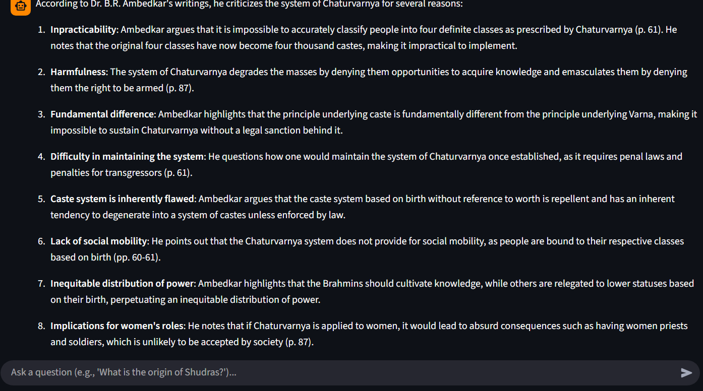
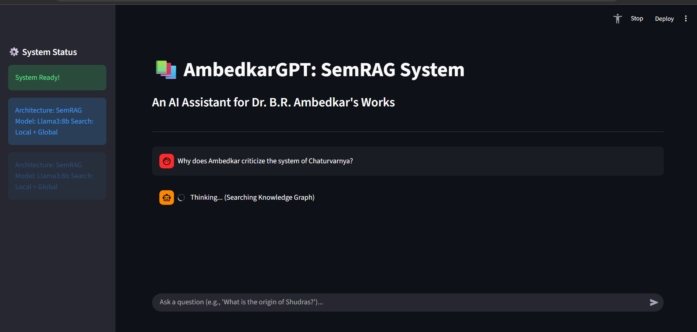
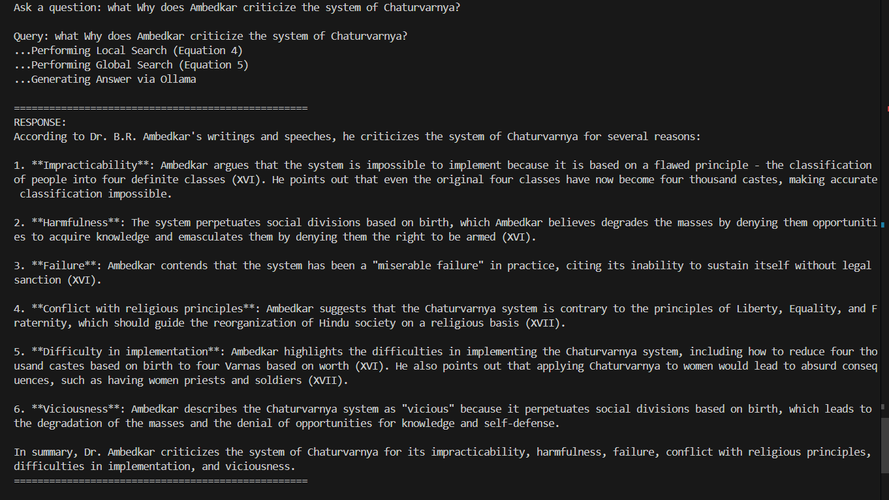
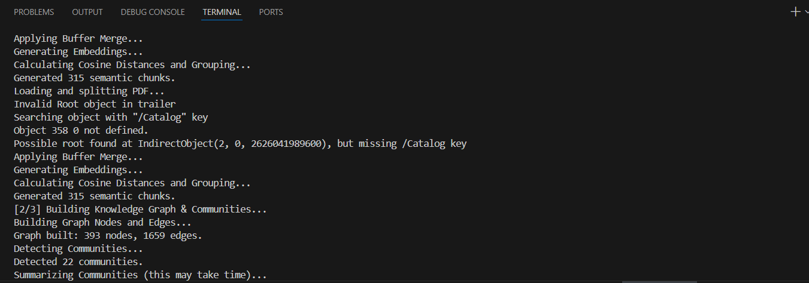

AmbedkarGPT: Semantic RAG System

An AI-powered question-answering system for Dr. B.R. Ambedkar's works, built using Semantic Retrieval-Augmented Generation (SemRAG) architecture with knowledge graphs and community detection.

Features

Semantic Chunking: Intelligent document splitting using cosine similarity-based breakpoints
Knowledge Graph Construction: Entity extraction and relationship mapping
Community Detection: Leiden algorithm for topic clustering
Hybrid Search: Combined local (entity-based) and global (community-based) retrieval
Interactive UI: Streamlit-based chat interface
Local LLM Integration: Powered by Ollama (Llama 3)

## Architecture

```txt
Input: PDF Document
│
├── Step 1: Semantic Chunking (Algorithm 1)
│   ├── Sentence splitting with spaCy
│   ├── Buffer merging for context preservation
│   ├── Cosine distance–based breakpoint detection
│   └── Overlap splitting for large chunks
│
├── Step 2: Knowledge Graph Construction
│   ├── Entity extraction (spaCy NER)
│   ├── Relationship mapping
│   ├── Community detection (Leiden algorithm)
│   └── Community summarization (LLM)
│
└── Step 3: Retrieval Engine
    ├── Local Search: Entity + Chunk similarity
    ├── Global Search: Community-based retrieval
    └── Hybrid fusion of results

Answer Generation (LLM)
└── Context injection into Ollama / Llama-3
```

---

## Project Structure

```txt
ambedkargpt1_copy/
├── .pytest_cache/                 # Pytest cache directory
├── data/
│   └── Ambedkar_book.pdf         # Source document
├── processed/
│   ├── chunks.pkl                # Cached semantic chunks
│   └── knowledge_graph.pkl       # Cached knowledge graph
├── src/
│   ├── chunking/
│   │   ├── __init__.py
│   │   └── semantic_chunker.py   # Semantic chunking (Algorithm 1)
│   ├── graph/
│   │   ├── __init__.py
│   │   ├── community_detector.py # Leiden algorithm
│   │   └── entity_extractor.py   # spaCy NER
│   ├── graph_builder.py          # Knowledge graph construction
│   ├── llm/
│   │   ├── __init__.py
│   │   └── llm_client.py         # Local Ollama interface
│   └── pipeline/
│       ├── __init__.py
│       └── ambedkargpt1.py       # Pipeline main orchestrator
└── retrieval/
    ├── __init__.py
    ├── global_search.py          # Community-based retrieval
    └── local_search.py           # Entity + chunk similarity
```

Installation

Prerequisites

Python 3.12+
Ollama installed (Download here)

Step 1: Clone the Repository
bashgit clone https://github.com/yourusername/ambedkargpt1.git
cd ambedkargpt1
Step 2: Install Dependencies
bashpip install -r requirements.txt
Required packages:
sentence-transformers
langchain-text-splitters
spacy
pypdf
pyyaml
networkx
scikit-learn
ollama
streamlit
Step 3: Download spaCy Model
bashpython -m spacy download en_core_web_sm
Step 4: Install Ollama Model
bashollama pull llama3:8b
For faster performance on CPU:
bashollama pull llama3.2:3b

Configuration
Edit config.yaml to customize the system:
yamlpaths:
  pdf_path: "data/Ambedkar_book.pdf"
  output_folder: "processed"

models:
  embedding_model: "all-MiniLM-L6-v2"
  llm_model: "llama3:8b"              # or "llama3.2:3b" for faster inference
  spacy_model: "en_core_web_sm"

chunking:
  buffer_size: 1                      # Context window for embedding
  breakpoint_threshold: 0.5           # Cosine distance threshold
  max_tokens: 1024                    # Maximum chunk size
  overlap_tokens: 128                 # Overlap for large chunks

graph:
  community_algorithm: "leiden"

retrieval:
  top_k_local: 5                      # Number of local search results
  top_k_global: 3                     # Number of global search results
  local_threshold_e: 0.3              # Entity similarity threshold
  local_threshold_d: 0.3              # Chunk similarity threshold

Usage

Method 1: Command Line Interface
Start Ollama server (in separate terminal):
bashollama serve
Run the pipeline:
bashpython src/pipeline/ambedkargpt1.py
Method 2: Streamlit Web UI
Start Ollama server:
bashollama serve
Launch Streamlit app:
bashstreamlit run app.py
Navigate to http://localhost:8501 in your browser.

Example Queries

"What did Ambedkar say about the origin of Shudras?"
"Explain Ambedkar's views on democracy"
"What is the relationship between caste and religion according to Ambedkar?"
"Describe Ambedkar's critique of Hinduism"

## Demo Screenshots

### 🔹 Streamlit UI – Home


### 🔹 Chat Interface


### 🔹 Example QA


### 🔹 Knowledge Graph Viewer


### 🔹 Logging Output (system.log)



Testing
Run the test suite:
bashpytest tests/
Run specific tests:
bashpytest tests/test_chunking.py -v
pytest tests/test_retrieval.py -v

Performance Optimization
For Faster Inference (CPU):

Use smaller model:

yaml   llm_model: "llama3.2:3b"  # or "llama3.2:1b"

Reduce retrieval results:

yaml   top_k_local: 3
   top_k_global: 2

Use quantized models:

bash   ollama pull llama3.2:3b-q4_0
For GPU Acceleration:
Install PyTorch with CUDA:
bashpip install torch torchvision torchaudio --index-url https://download.pytorch.org/whl/cu118
Using API-based Models (Fastest):
Replace Ollama with Groq (FREE) or OpenAI:
bashpip install groq
Update code to use Groq API for instant responses.

Troubleshooting
Error: "model 'llama3:8b' not found"
Solution:
bash# Start Ollama
ollama serve

# In another terminal, pull the model
ollama pull llama3:8b
Error: "Config file not found"
Solution: Ensure you're running from the project root:
bashcd C:\path\to\ambedkargpt1
python src/pipeline/ambedkargpt1.py
Error: "langchain.text_splitter not found"
Solution:
bashpip install langchain-text-splitters
Slow response times
Solutions:

Switch to llama3.2:3b model
Reduce top_k_local and top_k_global values
Use Groq API instead of local Ollama

References

SemRAG Architecture: Semantic Retrieval-Augmented Generation
Sentence Transformers: all-MiniLM-L6-v2
LLM: Llama 3 via Ollama
NER: spaCy en_core_web_sm
Community Detection: Leiden algorithm
